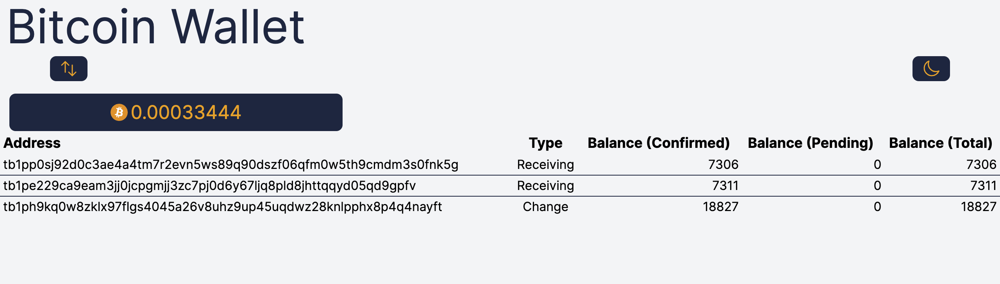
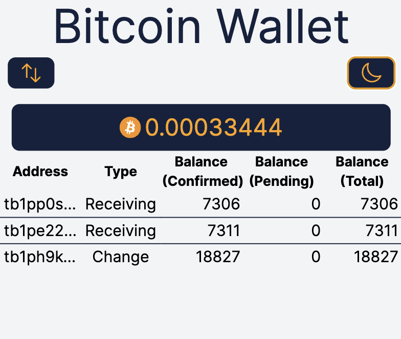
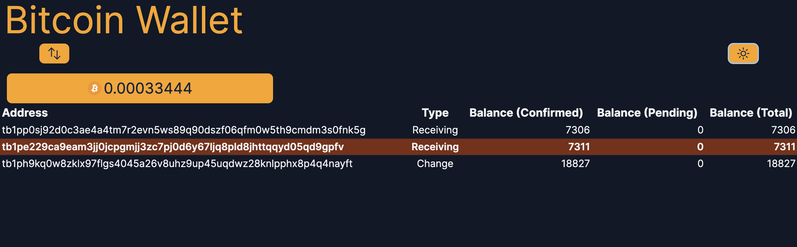
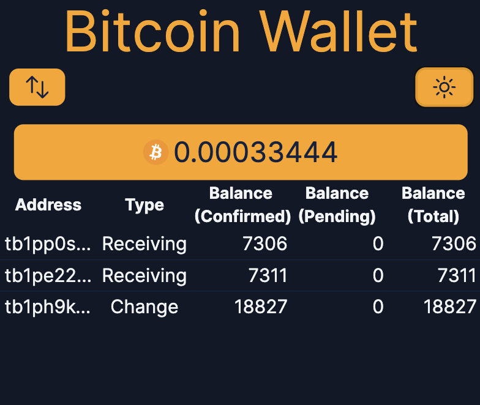

# Leptos BDK Wallet

<!-- markdownlint-disable html -->

[](https://opensource.org/licenses/MIT)

| :warning: WARNING                                             |
| :------------------------------------------------------------ |
| Do not use this wallet! It is for portfolio/learning purposes |

This is a [Leptos](https://github.com/leptos-rs/leptos) web framework project.
It is a Bitcoin wallet that uses [`mempool.space`](https://mempool.space/)
[Esplora](https://github.com/Blockstream/esplora/blob/master/API.md) API.

[Axum](https://github.com/tokio-rs/axum).

See it in action at [`vercel.app`](https://react-wallet-with-lasers.vercel.app/).

## Screenshots

<!-- markdownlint-disable line-length -->

| Desktop                                                                   | mobile                                                                  |
| ------------------------------------------------------------------------- | ----------------------------------------------------------------------- |
|  |  |
|    |    |

<!-- markdownlint-enable line-length -->

## Scope

Libraries used:

- [Leptos](https://github.com/leptos-rs/leptos) and
  [Axum](https://github.com/tokio-rs/axum)
  for the frontend/backend and async functionality.
- [Tailwind CSS](https://tailwindcss.com/) and [Preline](https://www.preline.co/) for styling.
- [BDK](https://github.com/bitcoindevkit/bdk) for Bitcoin
  functionality.

Functionality:

- Create a wallet from a network type (mainnet/testnet) and a mnemonic phrase.
- Taproot addresses and descriptors by default.
- Fetch the wallet's balance asynchronously from the Esplora API.
- Send transactions to a Bitcoin address.

Purpose:

- Learn how to build apps with Leptos.
- Learn how to fetch data asynchronously with Axum
  and do server-side rendering with async components.
- Use my knowledge of Docker to deploy the app to Vercel.

## How it works

The wallet is a single page application that has server-side rendering
on the transactions async API fetch from Esplora using the
[`bdk-esplora`](https://github.com/bitcoindevkit/bdk/tree/master/crates/esplora)
crate.
This is done by BDK.

Once the wallet is created, the app will fetch the wallet's balance
from the API and display them.
This is done with Axum's async components.
It uses the Esplora API which is hard-coded to use the `mempool.space` API.
The balance is shown and addresses are listed in a table.

There is a "Sync" button that will reset the cached-data from
the Esplora API and fetch the latest wallet balance.

Finally, there's a "Send" button that will send a transaction to a Bitcoin address.
By default, it will sweep the entire balance to the address.

## Getting Started

If you don't have `cargo-leptos` installed you can install it with:

```bash
cargo install cargo-leptos
```

Then, run the development server:

```bash
cargo leptos watch
```

## Installing Additional Tools

By default, this project uses `nightly` Rust, and `tailwindcss`.
If you run into any trouble, you may need to install one or more of these tools.

1. `rustup toolchain install nightly`: make sure you have Rust nightly
2. `rustup target add wasm32-unknown-unknown`:
   add the ability to compile Rust to WebAssembly
3. `npm install -g tailwindcss`: install `tailwindcss` globally

For `tailwindcss` you can also use `npx` to run it without installing it globally:
`npx tailwindcss -i ./input.css -o ./style/styles.css --watch`

## Compiling for Release

```bash
cargo leptos build --release
```

Will generate your server binary in
`target/server/release`
and your site package in `target/site`.

## Testing Your Project

```bash
cargo leptos end-to-end
```

```bash
cargo leptos end-to-end --release
```

Cargo-leptos uses Playwright as the end-to-end test tool.  
Tests are located in end2end/tests directory.

## Executing a Server on a Remote Machine Without the Toolchain

After running a `cargo leptos build --release` the minimum files needed are:

1. The server binary located in `target/server/release`
2. The `site` directory and all files within located in `target/site`

Copy these files to your remote server. The directory structure should be:

```text
start-axum
site/
```

Set the following environment variables (updating for your project as needed):

```text
LEPTOS_OUTPUT_NAME="start-axum"
LEPTOS_SITE_ROOT="site"
LEPTOS_SITE_PKG_DIR="pkg"
LEPTOS_SITE_ADDR="127.0.0.1:3000"
LEPTOS_RELOAD_PORT="3001"
```

Finally, run the server binary.

## Docker

TODO: Add Dockerfile and docker-compose.yml
